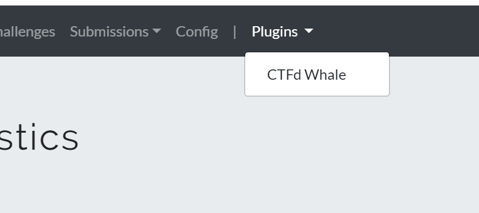
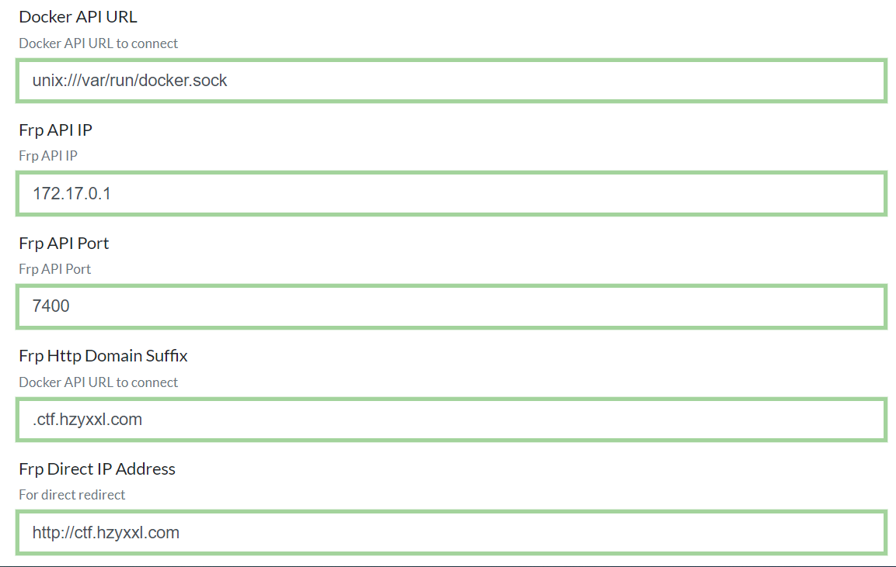
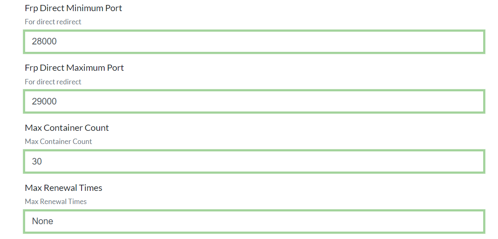
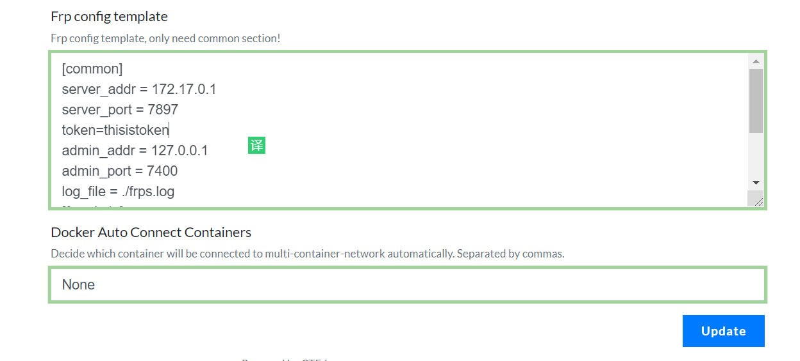
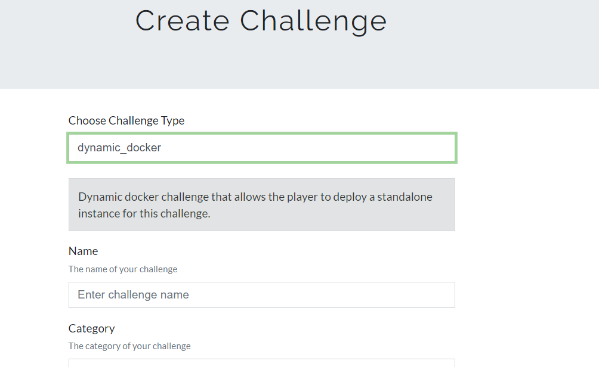
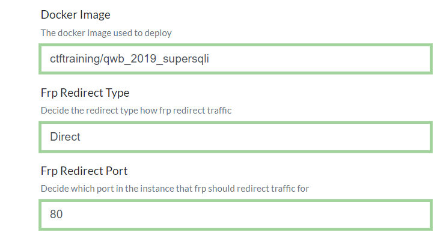
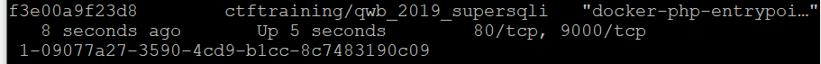
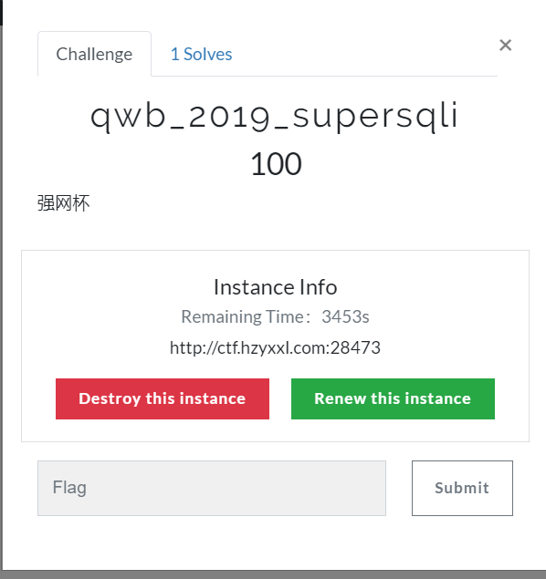
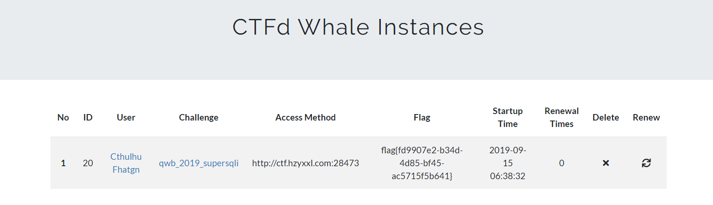

# 手把手教你如何建立一个支持ctf动态独立靶机的靶场
## 前言
要说开源的ctf训练平台，ctfd是不错的选择，支持各种插件，今天我就来介绍一下如何部署[赵今师傅](https://www.zhaoj.in/)为ctfd平台写的一款支持独立动态靶机的插件。前提是你的ctfd也是docker部署的。
## 动态独立靶机
说到独立动态靶机，各位ctfer可能会联想到i春秋举办的各类比赛，其中比赛环境大都用到了动态独立靶机（dynamic standalone instance）技术，也就是每做一道题，就会自动生成一个虚拟题目环境，每一个环境刚刚生成的时候都是崭新的，且能为每个队伍生成一个独一无二的flag，防止flag分享作弊的行为。
## 技术原理
先来看张图 = =

别被这张图吓到了， 这个图只是在本地部署动态靶机，而赵师傅的buuctf平台由于使用学校的服务器生成独立靶机还增加了内网穿透功能，网络结构要更复杂，所以这个插件有些功能是针对赵师傅下需求设计的，而我们仅仅只需要本地生成独立靶机即可，因此只需使用该插件如图所示的部分功能即可。
## 安装步骤
### 1.安装启动frps
下载frp

```bash
cd
wget https://github.com/fatedier/frp/releases/download/v0.29.0/frp_0.29.0_linux_amd64.tar.gz
tar -zxvf frp_0.29.0_linux_amd64.tar.gz
cd frp_0.29.0_linux_amd64
```
 编辑frps.ini以及frpc.ini
 ##### frps.ini
 
```
[common]
bind_port = 7897
bind_addr = 0.0.0.0
token =thisistoken
```

 ##### frpc.ini
 

```
[common]
server_addr = 172.17.0.1
server_port = 7897
token=thisistoken
admin_addr = 127.0.0.1
admin_port = 7400
log_file = ./frps.log
[frpadmin]
type = tcp
local_ip = 127.0.0.1
local_port = 7400
remote_port = 7400

```
后台启动frps
```bash
./frps -c frps.ini >> frps.log &
```

### 2.创建网络并启动frpc容器

```bash
docker network create ctfd_frp-containers
docker run  -d -v ~/frp_0.29.0_linux_amd64/frpc.ini:/etc/frp/frpc.ini --network="ctfd_frp-containers" --restart=always "glzjin/frp" 
```

### 3.安装插件
下载插件
```bash
cd CTFd/CTFd/plugins #打开ctfd插件目录
git clone https://github.com/glzjin/CTFd-Whale.git ctfd-whale #确保插件文件夹小写
cd ../.. #返回ctfd主目录
vim docker-compose.yml
```
配置docker-compose.yml
```yml
version: '2'

services:
  ctfd:
    build: .
    user: root
    restart: always
    ports:
      - "8000:8000" #你自己的
    environment:
      - UPLOAD_FOLDER=/var/uploads
      - DATABASE_URL=mysql+pymysql://root:ctfd@db/ctfd
      - REDIS_URL=redis://cache:6379
      - WORKERS=1
      - LOG_FOLDER=/var/log/CTFd
      - ACCESS_LOG=-
      - ERROR_LOG=-
    volumes:
      - .data/CTFd/logs:/var/log/CTFd
      - .data/CTFd/uploads:/var/uploads
      - .:/opt/CTFd:ro
      - /var/run/docker.sock:/var/run/docker.sock #添加这句即可，别的基本按照官方的不用动
    depends_on:
      - db
    networks:
        default:
        internal:

  db:
    image: mariadb:10.4
    restart: always
    environment:
      - MYSQL_ROOT_PASSWORD=ctfd
      - MYSQL_USER=ctfd
      - MYSQL_PASSWORD=ctfd
      - MYSQL_DATABASE=ctfd
    volumes:
      - .data/mysql:/var/lib/mysql
    networks:
        internal:
    # This command is required to set important mariadb defaults
    command: [mysqld, --character-set-server=utf8mb4, --collation-server=utf8mb4_unicode_ci, --wait_timeout=28800, --log-warnings=0]

  cache:
    image: redis:4
    restart: always
    volumes:
    - .data/redis:/data
    networks:
        internal:

networks:
    default:
    internal:
        internal: true

```
重新build后启动ctfd

```
docker-compose build
docker-compose up
```
启动ctfd后进入管理页面选择插件

填写相关参数，注意要在template里面写上frpc.ini的内容。里面domain填写自己的



启动题目选择dynamic_docker

这里选择一个支持动态FLAG的docker镜像，并选择设置该docker镜像的内部端口

内部端口可以用docker ps查看

### 4.测试
不出意外的话，现在在challenge界面可以使用动态靶机

管理员也可以在后台管理靶机

#### 常见错误分析与检查
##### 一般错误：
可以使用命令`docker logs <ctfd容器的ID>`查看报错情况
##### docker容器无法启动：
确保docker api填写正确，如示例中为unix:///var/run/docker.sock
你也可以使用端口形式的api如[官方示例](https://success.docker.com/article/how-do-i-enable-the-remote-api-for-dockerd)：可以用IP：端口指定API
然后使用如下命令进入ctfd容器，手动调用端口测试

```sh
docker exec -it <ctfd容器的ID> /bin/sh
/opt/CTFd# python
```
```python
>>>import docker
>>>client=docker.DockerClient(base_url="unix:///var/run/docker.sock")
>>>client.images.list()
```
如果api正确会列出所有镜像
##### frp端口无法映射：
可以使用如下命令进入ctfd容器，手动调用端口测试

```sh
docker exec -it <ctfd容器的ID> /bin/sh
/opt/CTFd# python
```
```python
>>>import requests
>>>requests.get("http://172.17.0.1:7400/api/reload")
<Response [200]> #这个表示成功

```
## 友情连接
[BUUCTF](https://buuoj.cn/)
<br>[Cthulhu OJ(还在备案中，无法访问80)](http://ctf.hzyxxl.com)
