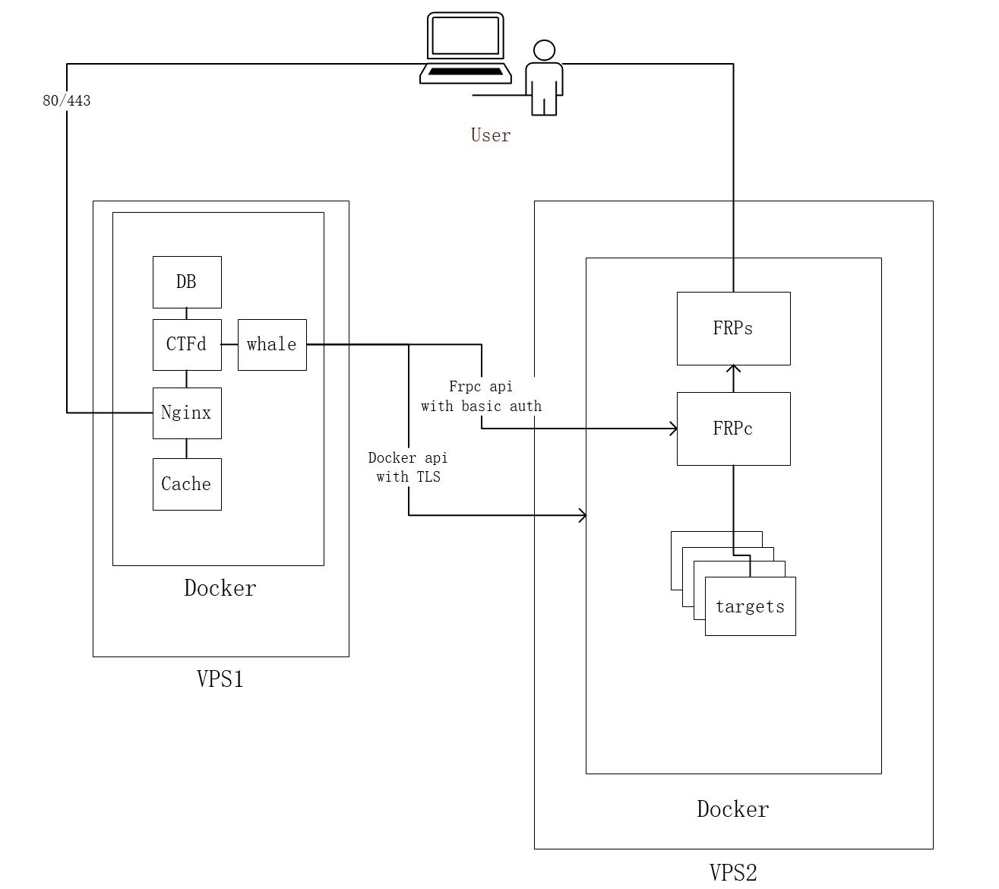
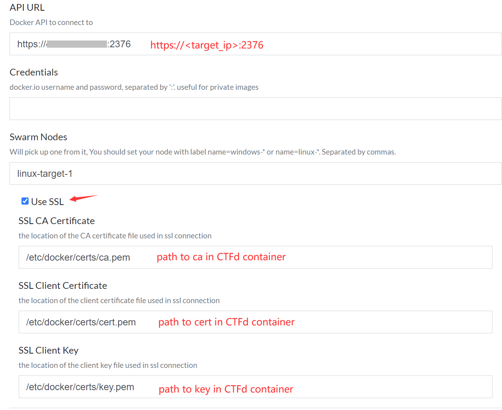
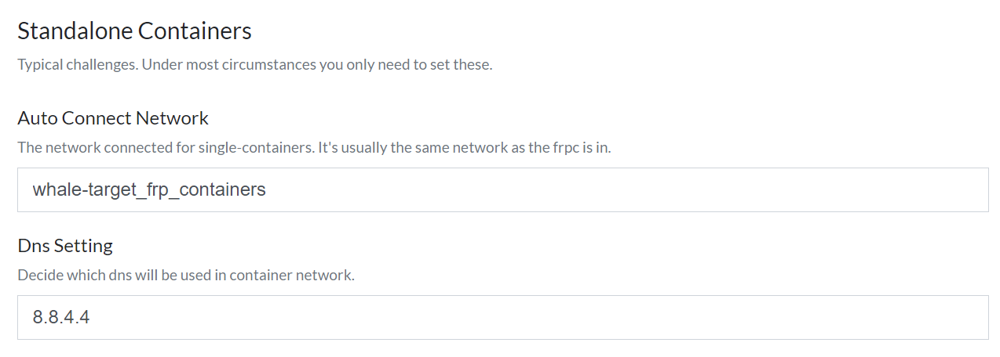
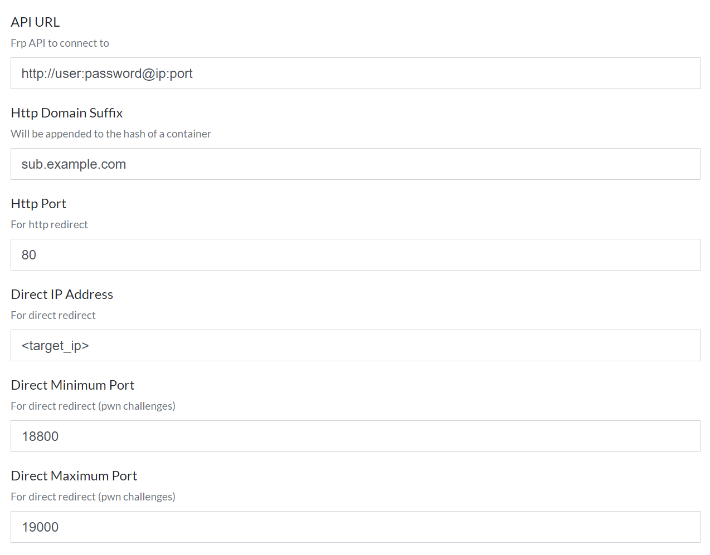

# 高级部署

## 前提

请确认你有过单机部署的经验，不建议第一次就搞这样分布架构

建议有一定Docker部署及操作经验者阅读此文档

在进行以下步骤之前，你需要先安装好ctfd-whale插件

## 目的

分离靶机与ctfd网站服务器，CTFd通过tls api远程调用docker

## 架构

两台vps

- 一台作为安装CTFd的网站服务器，称为 `web` ，需要公网IP
- 一台作为给选手下发容器的服务器，称为 `target` ，此文档用到的服务器是有公网IP的，但如果没有，可也在 `web` 服务器用 `frps` 做转发

本部署方式的架构如图所示



---

## 配置Docker的安全API

参考来源：[Docker官方文档](https://docs.docker.com/engine/security/protect-access/#use-tls-https-to-protect-the-docker-daemon-socket)


### target服务器配置

建议切换到 `root` 用户操作

### 克隆本仓库

```bash
$ git clone https://github.com/frankli0324/ctfd-whale
```

### 开启docker swarm

```bash
$ docker swarm init
$ docker node update --label-add "name=linux-target-1" $(docker node ls -q)
```

把 `name` 记住了，后面会用到

创建文件夹
```bash
$ mkdir /etc/docker/certs && cd /etc/docker/certs
```

设置口令，需要输入2次
```bash
$ openssl genrsa -aes256 -out ca-key.pem 4096
```

用OpenSSL创建CA, 服务器, 客户端的keys
```bash
$ openssl req -new -x509 -days 365 -key ca-key.pem -sha256 -out ca.pem
```

生成server证书，如果你的靶机服务器没有公网IP，内网IP理论上也是可以的，只要web服务器能访问到
```bash
$ openssl genrsa -out server-key.pem 4096
$ openssl req -subj "/CN=<target_ip>" -sha256 -new -key server-key.pem -out server.csr
```

配置白名单
```bash
$ echo subjectAltName = IP:0.0.0.0,IP:127.0.0.1 >> extfile.cnf
```

将Docker守护程序密钥的扩展使用属性设置为仅用于服务器身份验证
```bash
$ echo extendedKeyUsage = serverAuth >> extfile.cnf
```

生成签名证书，此处需要输入你之前设置的口令
```bash
$ openssl x509 -req -days 365 -sha256 -in server.csr -CA ca.pem -CAkey ca-key.pem \
-CAcreateserial -out server-cert.pem -extfile extfile.cnf
```

生成客户端(web服务器)访问用的 `key.pem`
```bash
$ openssl genrsa -out key.pem 4096
```

生成 `client.csr` ，此处IP与之前生成server证书的IP相同
```bash
$ openssl req -subj "/CN=<target_ip>" -new -key key.pem -out client.csr
```

创建扩展配置文件，把密钥设置为客户端身份验证用
```bash
$ echo extendedKeyUsage = clientAuth > extfile-client.cnf
```

生成 `cert.pem`
```bash
$ openssl x509 -req -days 365 -sha256 -in client.csr -CA ca.pem -CAkey ca-key.pem \
-CAcreateserial -out cert.pem -extfile extfile-client.cnf
```

删掉配置文件和两个证书的签名请求，不再需要
```bash
$ rm -v client.csr server.csr extfile.cnf extfile-client.cnf
```

为了防止私钥文件被更改以及被其他用户查看，修改其权限为所有者只读
```bash
$ chmod -v 0400 ca-key.pem key.pem server-key.pem
```

为了防止公钥文件被更改，修改其权限为只读
```bash
$ chmod -v 0444 ca.pem server-cert.pem cert.pem
```

打包公钥
```bash
$ tar cf certs.tar *.pem
```

修改Docker配置，使Docker守护程序可以接受来自提供CA信任的证书的客户端的连接

拷贝安装包单元文件到 `/etc` ，这样就不会因为docker升级而被覆盖
```bash
$ cp /lib/systemd/system/docker.service /etc/systemd/system/docker.service
```

将第 `13` 行
```
ExecStart=/usr/bin/dockerd -H fd:// --containerd=/run/containerd/containerd.sock
```
改为如下形式
```
ExecStart=/usr/bin/dockerd --tlsverify \
--tlscacert=/etc/docker/certs/ca.pem \
--tlscert=/etc/docker/certs/server-cert.pem \
--tlskey=/etc/docker/certs/server-key.pem \
-H tcp://0.0.0.0:2376 \
-H unix:///var/run/docker.sock
```

重新加载daemon并重启docker
```bash
$ systemctl daemon-reload
$ systemctl restart docker
```

**注意保存好生成的密钥，任何持有密钥的用户都可以拥有target服务器的root权限**

---

### Web服务器配置

在`root`用户下配置

```bash
$ cd CTFd
$ mkdir docker-certs
```

先把刚才打包好的公钥 `certs.tar` 复制到这台服务器上

然后解压
```bash
$ tar xf certs.tar
```

打开 `CTFd` 项目的 `docker-compose.yml` ，在`CTFd` 服务的 `volumes` 下加一条
```
./docker-certs:/etc/docker/certs:ro
```

顺便把 `frp` 有关的**所有**配置项删掉，比如`frp_network`之类


然后执行 `docker-compose up -d`

打开`CTFd-whale`的配置网页，按照如下配置docker



注意事项

- `API URL` 一定要写成 `https://<target_ip>:<port>` 的形式
- `Swarm Nodes` 写初始化 `docker swarm` 时添加的 `lable name`
- `SSL CA Certificates` 等三个路径都是CTFd容器里的地址，不要和物理机的地址搞混了，如果你按照上一个步骤更改好了 `CTFd` 的 `docker-compose.yml` ，这里的地址照着填就好

对于单容器的题目，`Auto Connect Network` 中的网络地址为`<folder_name>_<network_name>`，如果没有改动，则默认为 `whale-target_frp_containers`



*多容器题目配置 未测试*

---

## FRP配置

### 添加泛解析域名，用于HTTP模式访问

可以是这样
```
*.example.com
*.sub.example.com (以此为例)
```

### 在target服务器上配置

进入 `whale-target` 文件夹
```bash
$ cd ctfd-whale/whale-target
```

修改 `frp` 配置文件
```bash
$ cp frp/frps.ini.example frp/frps.ini
$ cp frp/frpc.ini.example frp/frpc.ini
```

打开 `frp/frps.ini`

- 修改 `token` 字段， 此token用于frpc与frps通信的验证
- 此处因为frps和frpc在同一台服务器中，不改也行
- 如果你的target服务器处于内网中，可以将 `frps` 放在 `web` 服务器中，这时token就可以长一些，比如[生成一个随机UUID](https://www.uuidgenerator.net/)
- 注意 `vhost_http_port` 与 [docker-compose.yml](/whale-target/docker-compose.yml) 里 `frps` 映射的端口相同
- `subdomain_host` 是你做泛解析之后的域名，如果泛解析记录为`*.sub.example.com`, 则填入`sub.example.com`


#### 打开 `frp/frpc.ini`

- 修改 `token` 字段与 `frps.ini` 里的相同

- 修改 `admin_user` 与 `admin_pwd`字段， 用于 `frpc` 的 basic auth

---

### 在WEB服务器上配置

打开whale的设置页面，按照如下配置参数



网页中，

- `API URL` 需要按照 `http://user:password@ip:port` 的形式来设置
- `Http Domain Suffix` 需要与 `frps.ini` 中的 `subdomain_host` 保持一致
- `HTTP Port` 与 `frps.ini` 的 `vhost_http_port` 保持一致
- `Direct Minimum Port` 与 `Direct Maximum Port` 与 `whale-target/docker-compose.yml` 中的段口范围保持一致
- 当 API 设置成功后，whale 会自动获取`frpc.ini`的内容作为模板

---

至此，分离部署的whale应该就能用了，可以找个题目来测试一下，不过注意docker_dynamic类型的题目似乎不可以被删除，请注意不要让其他管理员把测试题公开

你可以用 
```bash
$ docker-compose logs 
```
来查看日志并调试，Ctrl-C退出
